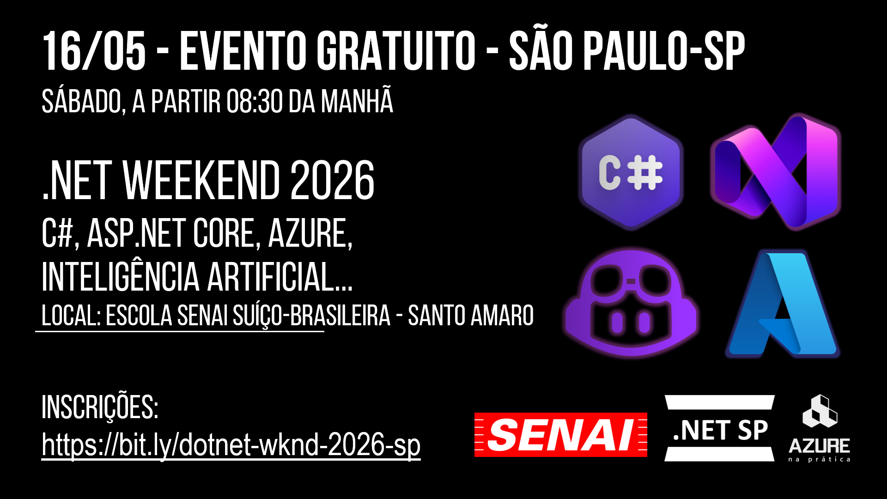
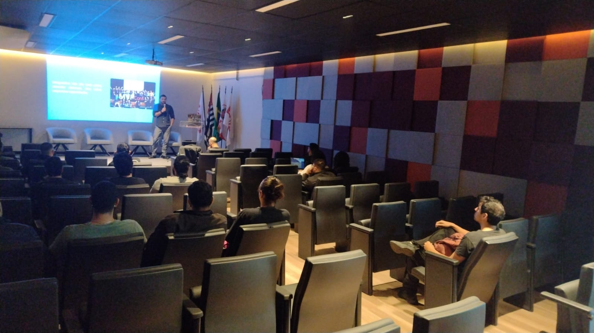
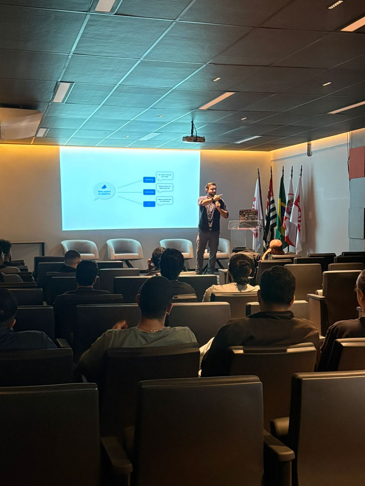
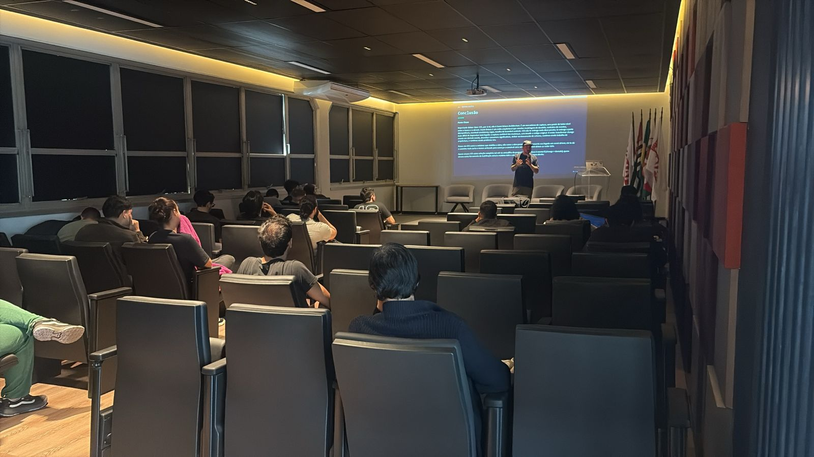
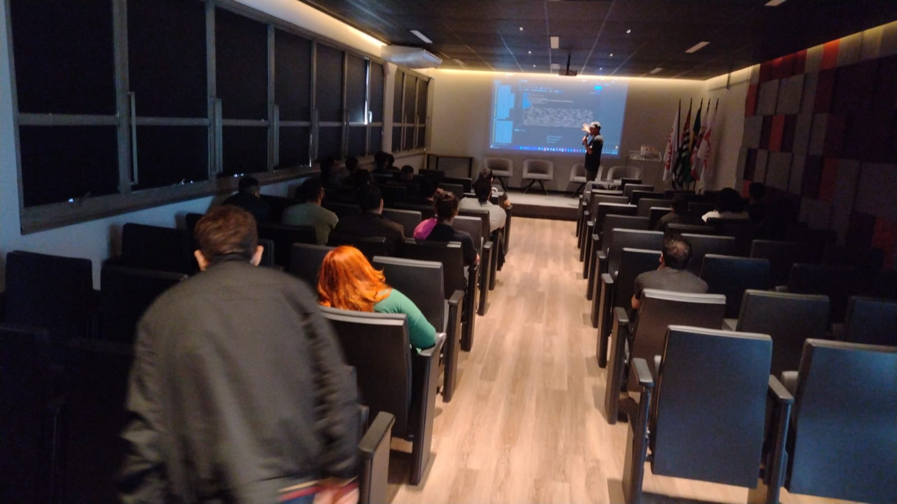
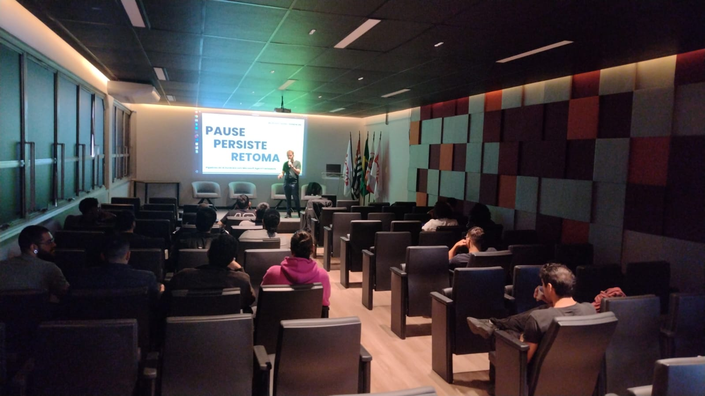
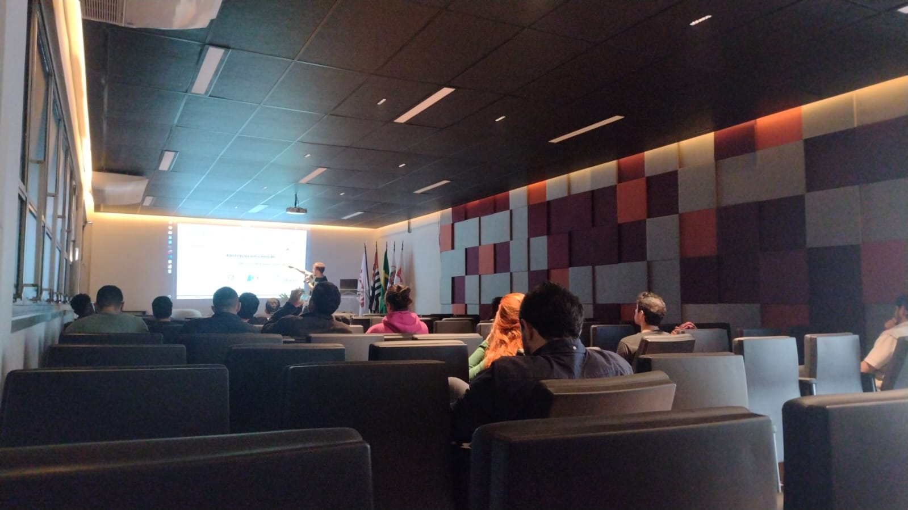
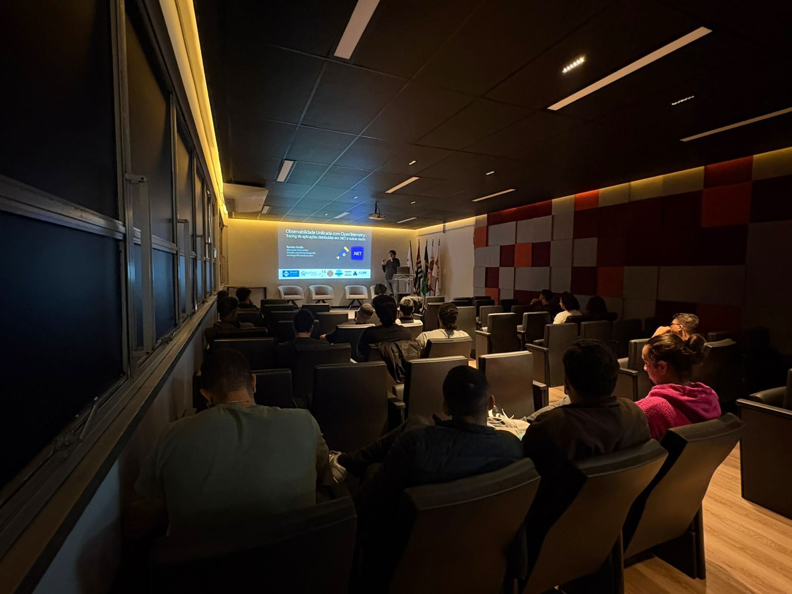
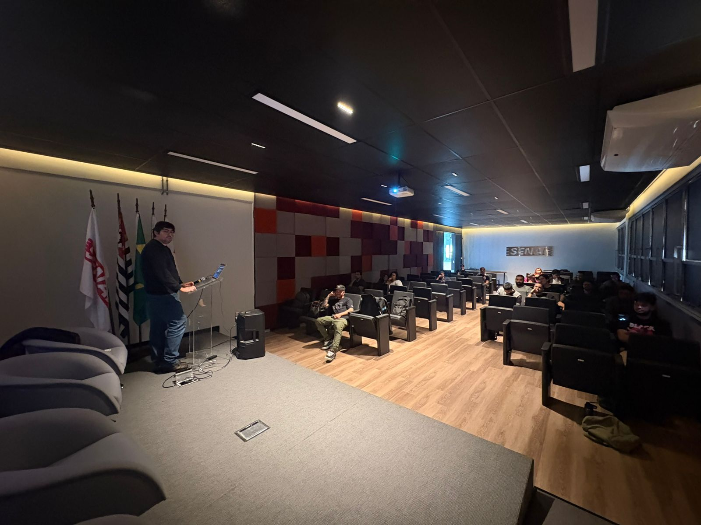
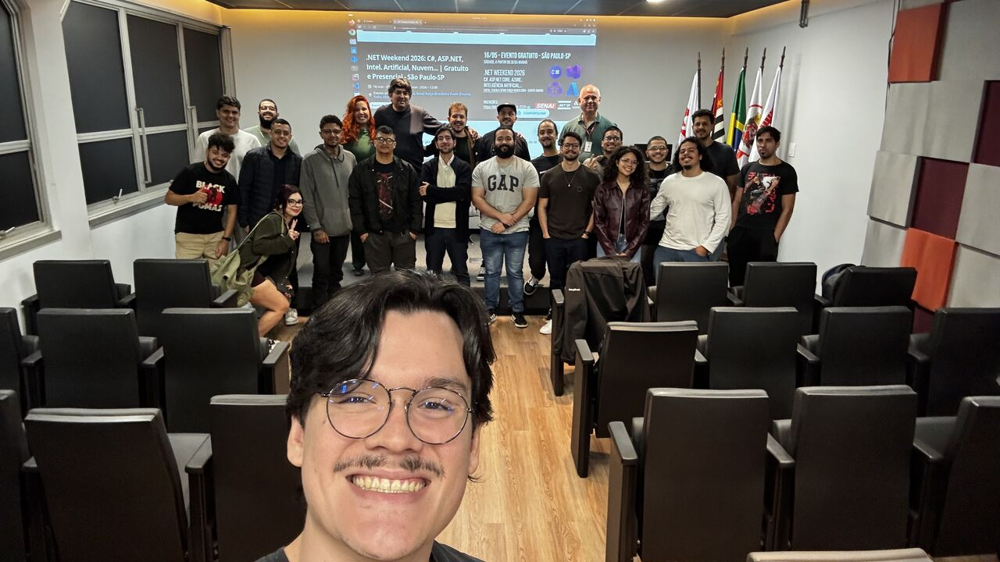

# .NET Weekend 2026: C#, ASP.NET, Artificial Intelligence, Cloud...
Photos and general information about the ".NET Weekend" event, held in the city of São Paulo, Brazil.

Date: **05/16/2026 (Saturday)**

Organizers:
- **Renato Groffe (Microsoft MVP, Docker Captain, Grafana Champion, APIsec U Ambassador, MTAC)**
- **Milton Camara Gomes (Microsoft MVP, MTAC)**
- **Carlos Machel (Microsoft MVP)**
- **Atila Olivi (SENAI)**

Number of attendees: **25 people**

---

Presentations/talks that took place during the event:

_# Modernizing Applications with Event-Driven_

Speaker: **Lucas Massena (Cloud Solutions Architect)**

Technologies and topics covered: **Event Streaming, Messaging, Azure Event Bus, Azure Service Bus, .NET, Azure Functions, Application Insights, Azure Monitor, Microservices...**

_# Decoupling the Legacy: How to modernize your architecture with .NET + Azure SQL Change Event Streaming_

Speaker: **Milton Camara Gomes (Microsoft MVP, MTAC)**

Technologies and topics covered: **Event Streaming, .NET, C#, ASP.NET Core, Azure SQL, Microsoft Azure...**

_# Pause. Persist. Resume: Durable AI Pipelines with Microsoft Agent Framework!_

Speaker: **Carlos Machel (Microsoft MVP)**

Technologies and topics covered: **.NET, C#, ASP.NET Core, Microsoft Agent Framework, Microsoft Foundry, Artificial Intelligence, MCP, LLMs, Agents...**

_# Unified Observability with OpenTelemetry: tracing distributed applications in .NET and other stacks!_

Speaker: **Renato Groffe (Microsoft MVP, Docker Captain, Grafana Champion, APIsec U Ambassador, MTAC)**

Technologies and topics covered: **Observability, Logs, Metrics, Traces, Microservices, Distributed Applications, OpenTelemetry, Grafana, Tempo, Prometheus, Loki, Alloy, Docker, Docker Compose, Linux, .NET, C#, ASP.NET Core, Minimal APIs, Node.js, Java, Apache Camel, PostgreSQL, Azure Monitor, Application Insights, Jaeger, Zipkin...**

---

Access this [**link**](/img/) to view all presentation photos.

This event was a partnership between the communities [**.NET SP**](https://www.meetup.com/dotnet-Sao-Paulo/), [**Azure na Prática**](https://www.youtube.com/azurenapratica) and the [**Escola Senai Suíço-Brasileira Paulo Ernesto Tolle**](https://suicobrasileira.sp.senai.br/).

Registration form: [**Sympla**](https://www.sympla.com.br/evento/net-weekend-2026-c-asp-net-intel-artificial-nuvem-gratuito-e-presencial-sao-paulo-sp/3401422)

Venue: **Escola SENAI Suíço-Brasileira Paulo Ernesto Tolle - Rua Bento Branco de Andrade Filho, 379 - Santo Amaro - São Paulo/SP - ZIP 04757-000**

---

